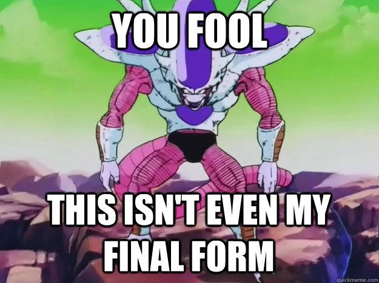

DISTek Software Craftsmanship Club 17 - Rover Refactor's Final Form
===================================================================
Coding Kata: [Simple Mars Rover Kata on Katalyst](https://katalyst.codurance.com/simple-mars-rover)

_Clean Code_ Chapter 17: Smells and Heuristics
----------------------------------------------
* Comments
  * C1: Inappropriate information
  * C2: Obsolete comment
  * C3: Redundant comment
  * C4: Poorly written comment
  * C5: Commented-out code
* Environment
  * E1: Build requires more than one step
  * E2: Tests require more than one step
* Functions
  * F1: Too many arguments
  * F2: Output arguments
  * F3: Flag arguments
  * F4: Dead function
* General
  * G1: Multiple languages in one source file
  * G2: Obvious behavior is unimplemented
  * G3: Incorrect behavior is unimplemented
  * G4: Overridden safeties
  * G5: Duplication
  * G6: Code at wrong level of abstraction
  * G7: Base classes depending on their derivatives
  * G8: Too much information
  * G9: Dead code
  * G10: Vertical separation
  * G11: Inconsistency
  * G12: Clutter
  * G13: Artificial coupling
  * G14: Feature envy
  * G15: Selector arguments
  * G16: Obscured intent
  * G17: Misplaced responsibility
  * G18: Inappropriate static
  * G19: Use explanatory variables
  * G20: Function names should say what they do
  * G21: Understand the algorithm
  * G22: Make logical dependencies physical
  * G23: Prefer polymorphism to if/else or switch/case
  * G24: Follow standard conventions
  * G25: Replace magic numbers with named constants
  * G26: Be precise
  * G27: Structure over convention
  * G28: Encapsulate conditionals
  * G29: Avoid negative conditionals
  * G30: Functions should do one thing
  * G31: Hidden temporal couplings
  * G32: Don't be arbitrary
  * G33: Encapsulate boundary conditions
  * G34: Functions should descend only one level of abstraction
  * G35: Keep configurable data at high levels
  * G36: Avoid transitive navigation
* Java
  * J1: Avoid long import lists by using wildcards
  * J2: Don't inherit constants
  * J3: Constants vs. enums
* Names
  * N1: Choose descriptive names
  * N2: Choose names at the appropriate level of abstraction
  * N3: Use standard nomenclature where possible
  * N4: Unambiguous names
  * N5: Use long names for long scopes
  * N6: Avoid encodings
  * N7: Names should describe side effects
* Tests
  * T1: Insufficient tests
  * T2: Use a coverage tool!
  * T3: Don't skip trivial tests
  * T4: An ignored test is a question about an ambiguity
  * T5: Test boundary conditions
  * T6: Exhaustively test near bugs
  * T7: Patterns of failure are revealing
  * T8: Test coverage patters can be revealing
  * T9: Tests should be fast

### Don't forget what you've already learned!
* [_Clean Code_ Chapter 14: "Successive Refinement"](../arg-parser/readme.md)
* [_Clean Code_ Chapter 13: "Concurrency"](../kprimes-concurrent/readme.md)
* [_Clean Code_ Chapter 12: "Emergence"](../kprimes/readme.md)
* [_Clean Code_ Chapter 11: "Systems"](../rover-factory/readme.md)
* [_Clean Code_ Chapter 10: "Classes"](../rover-refactor/readme.md)
* [_Clean Code_ Chapter 9: "Unit Tests"](../rover-redux/README.md)
* [_Clean Code_ Chapter 8: "Boundaries"](../password-encrypt/README.md)
* [_Clean Code_ Chapter 7: "Error Handling"](../password/README.md)
* [_Clean Code_ Chapter 6: "Objects & Data Structures"](../bowling/README.md)
* [_Clean Code_ Chapter 5: "Formatting"](../tiny-maze/README.md)
* [_Clean Code_ Chapter 4: "Comments"](../arithmetic/README.md)
* [_Clean Code_ Chapter 3: "Functions"](../alphabet-cipher/README.md)
* [_Clean Code_ Chapter 2: "Meaningful Names"](../rover/README.md)

Rover Refactor: Final Form
--------------------------

Refactor the rover project yet again (Chapter 2, Chapter 9, Chapter 10) to look for the code smells covered in
Chapter 17.

The End
-------
You did it! You made it to the end of the book! Congrats, and keep practicing what you've learned both in your
professional and personal code -- code craftsmanship takes a lifetime to master.